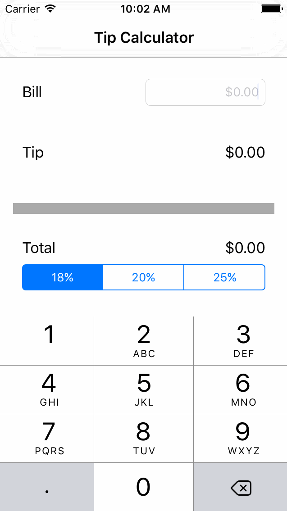

# Pre-work - *Name of App Here*

Tips is a tip calculator application for iOS.

Submitted by: Scott Horsfall

Time spent: 2 hours spent in total

## User Stories

The following **required** functionality is complete:
DONE - User can enter a bill amount, choose a tip percentage, and see the tip and total values.

The following **optional** features are implemented:
Opens when app launches - Making sure the keyboard is always visible and the bill amount is always the first responder. This way the user doesn't have to tap anywhere to use this app. Just launch the app and start typing.

The following **additional** features are implemented:
- Nothing yet, hoping to add tip splitting this weekend!

## Video Walkthrough 

Here's a walkthrough of implemented user stories:

GIF created with [LiceCap](http://www.cockos.com/licecap/).

## Notes

Had some issues with the hardware keyboard in simulator not showing with the bill field set as the first responder 

## License

Copyright 2016 Scott Horsfall

Licensed under the Apache License, Version 2.0 (the "License");
you may not use this file except in compliance with the License.
You may obtain a copy of the License at

http://www.apache.org/licenses/LICENSE-2.0

Unless required by applicable law or agreed to in writing, software
distributed under the License is distributed on an "AS IS" BASIS,
WITHOUT WARRANTIES OR CONDITIONS OF ANY KIND, either express or implied.
See the License for the specific language governing permissions and
limitations under the License.